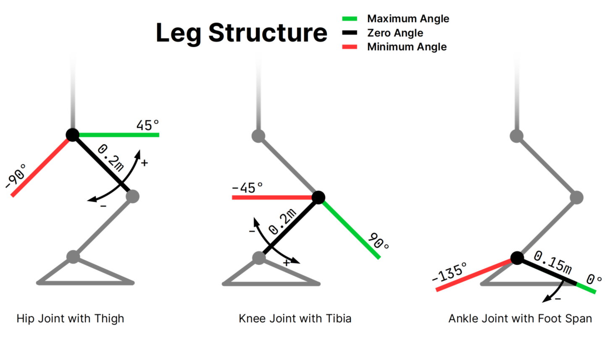
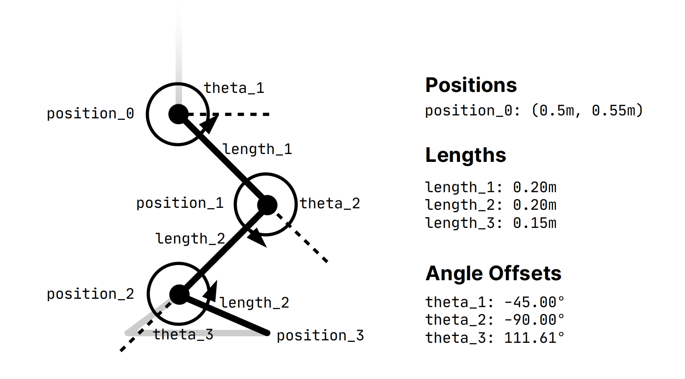
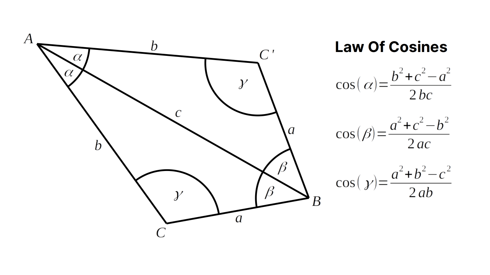

# Motion Task

<x-prologue image="recruiting-website-motion" command="bash -c 'cp /usr/src/app/{*.py,*.png,*.ttf} /data/ && echo Initialized files.'" />

## Introduction

In this task you are supposed to help the Nao robot kick the ball as close to the grey target position as possible. To simplify this task, we will work in 2-dimensions only. For defining a kick motion, you should set the angles for the three parts of the Nao leg (thigh, tibia and foot).

Note that every joint has a minimum and maximum angle.

If you want to test your code, you can click the "Generate animation" button below to see a visualisation of your code. In the left upper corner, you can see the time that has passed (in seconds) and the number below that shows the smallest distance between the ball and the target that you achieved with your current code.

## Keyframes

A motion is defined by a list of keyframes. Each keyframe contains the target angles (in radians) of the thigh, tibia and foot joints as well as the duration in which the keyframe should be executed.
The position of the three joints and the neutral angles can be seen in the picture below.



<x-text-editor file="/data/generate_keyframes.py" mode="python" />

<x-button image="recruiting-website-motion" command="python generate_animation.py" label="Generate animation" working-directory="/data" />

<x-image-viewer file="/data/animation.webp" mime="image/webp" />

## Kinematic Chain

In the following sections, we explore how [end effector](https://en.wikipedia.org/wiki/Robot_end_effector) positions and joint angles can be computed with [kinematic chains](https://en.wikipedia.org/wiki/Kinematic_chain). A kinematic chain is a mathematical model of how joints are connected together. It allows to calculate the position of the end effector from joint angles (forward kinematics) or joint angles from the position of the end effector (inverse kinematics).

### Forward Kinematics

With the so called [forward kinematics](https://en.wikipedia.org/wiki/Forward_kinematics) one can calculate the position of the end effector from the set of involved joint angles. Just from common sense it is obvious, that such a calculation is possible, because the position in space is exactly defined, when given all joint angles. Since we want to control the robot's leg, we need a model of the leg first. Recall to the leg structure that we introduced earlier:



The kinematic chain is constructed starting at the body of the robot where the leg is mounted. In our case this is the position of the hip joint or `position_0`. For calculating `position_1` at the end of the thigh with the length `length_1` and angle `theta_1`:

```python
theta_1_with_offset = theta_1 - math.radians(45)

position_1 = Vec2d(
    position_0.x + math.cos(theta_1_with_offset) * length_1,
    position_0.y + math.sin(theta_1_with_offset) * length_1,
)
```

The end position of the tibia `position_2` is rotated by `theta_2` around `position_1` and translated by `length_2`. Since the zero angle depends on `theta_1` it is added to `theta_2` (rotating the hip joint also rotates the end effector of our kinematic chain):

```python
theta_2_with_offset = theta_1_with_offset + theta_2 - math.radians(90)

position_2 = Vec2d(
    position_1.x + math.cos(theta_2_with_offset) * length_2,
    position_1.y + math.sin(theta_2_with_offset) * length_2,
)
```

Lastly, the end position of the foot span `position_3` is rotated by `theta_3` around `position_2` and translated by `length_3`. Again, the previous rotation `theta_2` is added to `theta_3`:

```python
theta_3_with_offset = theta_2_with_offset + theta_3 + math.radians(111.61)

position_3 = Vec2d(
    position_2.x + math.cos(theta_3_with_offset) * length_3,
    position_2.y + math.sin(theta_3_with_offset) * length_3,
)
```

When combining all calculations together we can now calculate all positions and rotations of the joints given the joint angles. In the following code the forward kinematics calculations are defined in the function `forward_kinematics()`. The function gets the initial position `position_0`, all joint angles `theta_*`, and segment lengths `length_*`. It returns all joint positions and the rotation of the end effector (at `position_3`, i.e. `rotation_3`):

<x-text-editor file="/data/forward_kinematics.py" mode="python" />

You can execute the above code by clicking the following button. Feel free to change the code (e.g. the angles `theta_*`).

<x-button image="recruiting-website-motion" command="python forward_kinematics.py" label="Apply forward kinematics" working-directory="/data" />

The output shows a visualization of the calculated joint positions with the help of the forward kinematics:

<x-image-viewer file="/data/forward_kinematics.png" mime="image/png" />

We can see that the forward kinematics are an easy way to calculate the end effector position and rotation given all joint angles and segment lengths. In the next section we will use the inverse kinematics to calculate the joint angles from a given end effector position and rotation.

### Inverse Kinematics

[Inverse kinematics](https://en.wikipedia.org/wiki/Inverse_kinematics) describe the inverse transform of the above described forward kinematics. In other words, when given a desired position and rotation of an end effector, one can obtain the joint angles necessary to reach this position from the inverse kinematics. One could use the forward kinematics to form an equation system for finding the joint angles (forward kinematics: *joint angles* -> *position*, inverse kinematics: *position* -> *joint angles*).

In contrast to the forward kinematics such a solution does not always exist and can be ambiguous. In our example, we may have one of three possible cases: 1. *no solution* (impossible to reach), 2. *one solution* (only one set of joint angles reach the position), 3. *two solutions* (position is reachable with two sets of joint angles). As a more understandable example, consider holding your hand in fixed position in front of your head. You will find, that there exist an infinite amount of different arm angles to achieve this, i.e. there exist infinite solutions for possible joint angles.

Calculating the inverse kinematics can be performed in many possible ways. In special cases the inverse kinematics can be calculated analytically. But solving more complex forward kinematics may require numerical methods. In our example, we will calculate the inverse kinematics analytically and step-by-step to understand the concepts. Again, this is the kinematic chain used in the following sections:


Given an end effector position `position_3` and rotation `rotation_3` we will now calculate the required joint angles to reach the position. The calculation is divided into two parts: Calculating the position `position_2` first and then calculating the remaining angles `theta_3`, `theta_2`, and `theta_1`. Since we start with the position of the end effector and rotation, the `position_2` is simply the vector from `position_3` rotated by `rotation_3` with a length `length_3` (the vector is subtracted to point in the other direction, i.e. to `position_2`):

```python
position_2 = Vec2d(
    position_3.x - math.cos(rotation_3) * length_3,
    position_3.y - math.sin(rotation_3) * length_3,
)
```

This achieves the first step of our calculation. The second step is to calculate the joint angles. As mentioned earlier, we might either not reach the end effector position (because the leg is simply too short), or the joint angles may be ambiguous. In the inverse kinematics calculation, we know the hip joint position `position_0` which means we can calculate the euclidian distance between `position_0` and `position_2`. We consider three cases:

1. Distance between `position_0` and `position_2` is *larger* than `length_1 + length_2`.
2. Distance between `position_0` and `position_2` is *equal* to `length_1 + length_2`.
3. Distance between `position_0` and `position_2` is *smaller* than `length_1 + length_2`.

In case 1 there exists no solution (leg is too short), case 2 yields one exact solution of joint angles (non-ambiguous), and case 3 creates two possible sets of joint angles (ambiguous).

Let's begin with **case 1 (leg too short)**: In this case the inverse kinematics does not have any solution. There does not exist any set of joint angles reaching the given end effector position and rotation.

In **case 2 (non-ambiguous)** the leg is fully stretched (no rotation change in knee joint, i.e. `90°` when including angle offsets):

```python
theta_2 = 0
theta_2_with_offset = theta_2 + math.radians(90)
```

`theta_1` is calculated as the angle between `-45°` (angle offset) and the distance vector of `position_0` to `position_2`:

```python
theta_1 = math.atan((position_2.y - position_0.y) /
                    (position_2.x - position_0.x))
theta_1_with_offset = theta_1 + math.radians(45)
```

The ankle joint must rotate to the final rotation `rotation_3` which means it is the remaining angle `theta_3` (since `theta_2` is zero, it can be omitted):

```python
theta_3 = rotation_3 - theta_1 - theta_2
theta_3_with_offset = theta_3 - math.radians(111.61)
```

The inverse kinematics for case 2 yields the joint angles `theta_*_with_offset`.

For **case 3 (ambiguous)** the inverse kinematics has two possible positions for the knee joint because the leg is longer than the distance between `position_0` and `position_2`. We are interested in the angles of the joints and already know the lengths between the joints. With the [law of cosines](https://en.wikipedia.org/wiki/Law_of_cosines) we can interpret the two solutions for the inverse kinematics as two triangles:



Assume that the point *A* is `position_0`, *C* and *C'* are the two solutions for `position_1`, and *B* is `position_2`. Then α corresponds to `theta_1`, γ corresponds to `theta_2`, and β corresponds to `theta_3` (they are not the same because of angle and rotation offsets). The lengths `a` and `b` are thigh and tibia length (`0.2m`), `c` is the distance between `position_0` and `position_2`.

First, the rotation of the distance vector of `position_0` to `position_2` is calculated (as before but we don't need the angle offset):

```python
theta_1_1 = math.atan((position_2.y - position_0.y) /
                      (position_2.x - position_0.x))
```

This angle represents the rotation of the `c` line in the triangle above. The angle α is calculated with:

```python
theta_1_2 = math.acos(
    (distance_0_to_2 ** 2 + length_1 ** 2 - length_2 ** 2) /
    (2 * distance_0_to_2 * length_1),
)
```

The resulting angles for both joint angle solutions are calculated by substracting or adding α to the rotation of the distance vector:

```python
 first_theta_1 = theta_1_1 - theta_1_2
second_theta_1 = theta_1_1 + theta_1_2
 first_theta_1_with_offset =  first_theta_1 + math.radians(45)
second_theta_1_with_offset = second_theta_1 + math.radians(45)
```

The next step is to calculate the angle γ with the same approach:

```python
theta_2 = math.acos(
    (length_1 ** 2 + length_2 ** 2 - distance_0_to_2 ** 2) /
    (2 * length_1 * length_2),
)
```

The angle γ measures between the thigh and tibia but is rotated by `180°` and again substracted or added:

```python
 first_theta_2 = math.pi - theta_2_1
second_theta_2 = theta_2_1 - math.pi
 first_theta_2_with_offset =  first_theta_2 + math.radians(90)
second_theta_2_with_offset = second_theta_2 + math.radians(90)
```

The third angle `theta_3` can be calculated by substracting `theta_1` and `theta_2` from `rotation_3` because the sum of all three angles must result in the rotation of the end effector:

```python
 first_theta_3 = rotation_3 -  first_theta_1 -  first_theta_2
second_theta_3 = rotation_3 - second_theta_1 - second_theta_2
 first_theta_3_with_offset =  first_theta_3 - math.radians(111.61)
second_theta_3_with_offset = second_theta_3 - math.radians(111.61)
```
